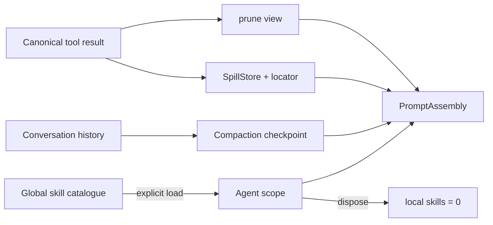

# L08 上下文、压缩、Skill 与 Spill

本课回答一个实现问题：同一份工具结果为什么可以有不同的「模型视图」，而恢复、审计和重新读取仍然拿到原值？课程参考 DeepSeek Harness 快照中的 system prompt、request context、compaction、skill、spill 和 token meter，构造一个无网络的概念实验。

## 先运行

```bash
./deepseek-harness-lessons/scripts/run_lesson.sh 08
node --experimental-strip-types deepseek-harness-lessons/08_context_scope/tests/context.test.ts
```

输出是稳定 JSON。`facts.measurements` 比较 `raw`、`prune`、`spill`、`compact`、`combined` 五个档位；`events` 是可检查的装配和生命周期证据。
测试还会与 `tests/fixtures/expected.ts` 的策略、事实数量和 scope 快照对照。

## 快照映射

| 实验概念 | 固定快照锚点 | 本实验中的职责 |
| --- | --- | --- |
| Rendered system prompt | `packages/core/system-prompt/` | 上游把 system 内容渲染成一个字符串；本实验也只生成一条 system message |
| Request context | `packages/context/` | 上游把 runtime / claimed context 追加为 session user entries；它不是 canonical tool-result view 的实现锚点 |
| Tool-result pruning | `packages/compaction/compaction-tool-result-pruner/` | 上游对过长工具结果做 head/middle/tail 视图裁剪；本实验改用保留标记事实的教学算法 |
| Compaction | `packages/compaction/` | 上游以事件驱动 checkpoint；本实验用确定性内存摘要表达相同的预算边界 |
| Skill catalog / invocation | `packages/skill/` | catalog 是 durable user-role 内容；skill 正文由 skill tool result 或显式用户调用进入上下文 |
| Spill policy | `packages/spill/spill-policy/` | 上游决定何时外置结果；本实验保存完整值并给模型 locator + 小型预览 |
| Token meter | `packages/llm/token-meter/` | 计算视图成本；这里用字符/4 的确定性替身 |

本课不复制上游源码。上表只说明阅读路径；实际源码应在 `upstream.lock.json` 的 commit `47f943859bef60e4160492346772ded9b24f765a` 上查看。

## 状态和所有权



- `CanonicalToolResult` 是本课定义的概念对象；pruner 和 spill 只生成 view，不回写 `value`。它不是上游 durable tool event 的类型别名。
- `SpillStore` 拥有 locator 对应的完整文本。生产实现需要把它放在可恢复的存储中；本实验内存实现只验证不变量。
- `AgentContextScope` 拥有已加载 skill 名称。全局目录只是定义，不会自动进入每个 Agent 的 user-role catalog；`dispose()` 清空局部目录。
- `runContextLab()` 用两个 scope 验证这一点：第一个 catalog 显式列出 `repo-review`，第二个保持空目录；实验没有把 skill 正文拼进 system prompt。
- `PromptAssembly` 是一次请求的短暂投影：既有 history 之后追加 runtime snapshot 和可选 skill catalog，两者都用 user role 表示；rendered system string 与 `request.tools` 是独立请求字段，不存在把五者串成一条上游统一消息顺序的契约。本实验没有实现 Session 持久化，也不拥有 canonical 数据。

`syntheticCanonicalBytes` 在五个档位保持一致，只说明本课序列化的 synthetic tool-result 对象没有被视图策略改写；它不是上游原始 durable event 的字节数。`modelVisibleTokens` 展示不同视图的预算成本，`preservedFacts` 和 `locators` 展示本课投影的不变量。认知质量、真实 tokenizer 和模型是否正确使用 locator，不能由这个 mock 证明；`combined` 也不保证总比单独 prune 更小。

## 读代码的建议顺序

1. 先看 `makeCanonicalResult()` 和 `assemblePrompt()`，确认概念 canonical value 与 request message/tool 结构是两件事。
2. 再看 `pruneToolResult()`、`spillToolResult()` 和 `compactHistory()`，比较它们分别改变了什么。
3. 最后看 `AgentContextScope` 的 `loadSkill()` / `dispose()`，观察局部所有权和卸载证据。
4. 运行测试中的失败断言：零预算、已 dispose scope 都必须 fail closed。

## 证据边界

- 能证明：本课视图变换的大小差异、标记事实保留、spill locator 可回读、skill catalog 不跨 scope 泄漏、dispose 事件存在。
- 不能证明：上游真实 tokenizer 的数值、压缩摘要的模型质量、文件系统 spill 的崩溃恢复、真实 API 的上下文窗口行为。
- 这套代码是固定快照的概念模型，不与上游 head/middle/tail pruner 或事件溯源 checkpoint 完全同构，也不是 DeepSeek Harness 的稳定 API。
