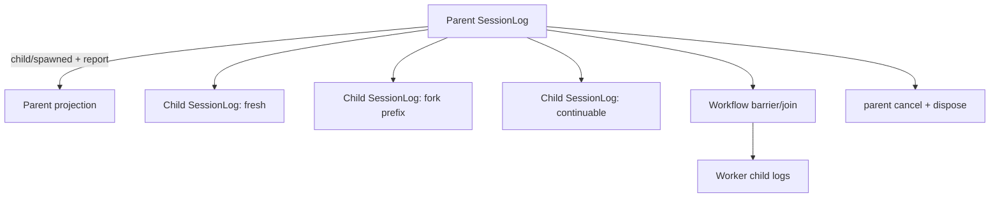

# L09 Subagent、Workflow 与所有权

本课把「多 Agent」拆成四个不同的生命周期决定：fresh spawn、completed-prefix fork、continuable child，以及由 workflow 调度的并行 worker。重点不是如何生成更多消息，而是每个子任务的 Session、projection、lineage、终态和 disposer 谁负责。

## 先运行

```bash
./deepseek-harness-lessons/scripts/run_lesson.sh 09
node --experimental-strip-types deepseek-harness-lessons/09_subagent_workflow/tests/subagent.test.ts
```

代码不创建真实进程或调用模型；`runWorkflow()` 用确定性 barrier/join 模拟 worker-thread 调度，以便快照和 replay 在 CI 中稳定。
`tests/fixtures/expected.ts` 固定 fresh/fork lineage、worker 数和终态，不把真实线程性能混进快照。

## 快照映射

| 本课实验 | 快照阅读锚点 | 要观察的契约 |
| --- | --- | --- |
| `spawn({mode:"fresh"})` | `packages/subagent/` | 新 Session 没有父历史，但有 parent lineage |
| `spawn({mode:"fork"})` | `packages/subagent/` | 只复制完成前缀，child log 与 parent log 分开 |
| `followUp()` | `packages/jobs/` / subagent docs | continuable child 可从成功终态重新运行 |
| `runWorkflow()` | `packages/workflow/` | worker barrier、join 和结构化 report |
| cancel/dispose | `packages/jobs/` | parent 拥有取消和 quiescence，child 留下终态证据 |

固定源码基线是 `upstream.lock.json` 中的 `47f943859bef60e4160492346772ded9b24f765a`；符号和目录可能随 rc 版本变化，不能把本实验接口当成稳定上游 API。

## 两棵日志树



父窗只保存生命周期摘要和 report；`child/input`、`child/failed` 等细节属于 child log。workflow 的 worker start、barrier、completed、join 也会写入 parent `SessionLog`，所以 `replayParent()` 能从 durable log 重建 worker ids 和 join 状态；`replayChild()` 重建单个 child 的终态、报告和 disposer。这样 parent projection 不会把 child 过程混成一条对话。

## 生命周期不变量

- Fresh child 的 `history` 长度为 0；fork child 复制 parent durable log 开头的完整 `TraceEvent`（包括 data、sessionId、sequence），伪造或只用 event type 的 prefix 会失败，并明确记录复制数量。
- One-shot child 成功后不能 `followUp`；continuable child 的 follow-up 会再次经历 running -> succeeded，并追加 report。
- 失败必须产生 `status=failed`、error 和结构化 report，不能用空字符串伪装成功。
- parent 取消会遍历仍处于 running 的 child；dispose 保留每个 child 的终态，同时记录 `child/disposed`，最后 `activeChildren()` 必须为 0。
- workflow 的 worker 可以并行实现，但结果必须带 child id、lineage 和可重放日志。这里的 barrier 是确定性替身，不证明真实线程调度性能。
- `SessionLog` 在追加时由日志重新写入 `sessionId/sequence`，调用方 data 不能伪造这些保真字段。

## 证据边界

本课能证明所有权、lineage、失败传播、父子日志分离和 quiescence。它不能证明真实 worker_threads 的崩溃恢复、跨机器队列语义、模型质量或上游 scheduler 的性能。要做平台实验，应在隔离 checkout 中使用上游真实 workflow/runtime，并单独记录平台和 commit。
