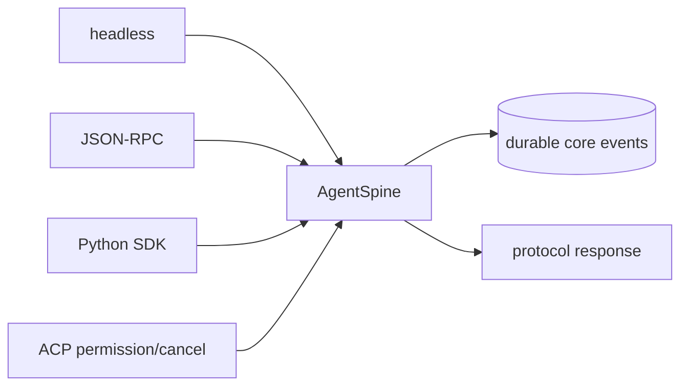

# L10 多产品表面与证据分层

同一个 Agent spine 被 headless、JSON-RPC、Python SDK 或 ACP 包装后，怎样证明它仍然是同一个运行时？本课把「产品入口」和「测试证据」拆开：入口只负责协议转换，核心 durable events 由同一个 `AgentSpine` 产生；每种测试只声称它真正覆盖的边界。

## 先运行

```bash
./deepseek-harness-lessons/scripts/run_lesson.sh 10
node --experimental-strip-types deepseek-harness-lessons/10_surfaces_testing/tests/surfaces.test.ts
```

实验不读取 API key，也不访问网络。`real-api-smoke` 会显式显示 `skip`；最终 `built-artifact-smoke=pass` 检查课程构建清单，另外保留 `negativeBuiltArtifact=fail`，演示 mock 全绿并不等于入口清单完整。它不是对 npm 发布包的真实 smoke。
核心 transcript 还要逐字匹配 `tests/fixtures/expected.ts`，不是只检查输出非空。

## 快照映射

| 本课 | 固定快照锚点 | 本实验观察 |
| --- | --- | --- |
| headless | `packages/bundle/headless/`, `examples/headless-agent/` | 直接调用 Agent spine |
| JSON-RPC | `packages/acp/`, `examples/jsonrpc-agent/` | JSON-RPC envelope 与 protocol-only stdout |
| Python SDK | `packages/sdk/`, `python/sdk/` | 上游 Python client 懒启动 JSON-RPC 子进程，并负责 initialize、transport、close 与进程回收；本课 facade 只模拟请求转换 |
| permission/cancel | `packages/acp/` | ask、deny、cancel 都有明确 response/event |
| testing | `docs/testing.md` | unit、HMR、real-composition、snapshot、real-API 分层 |

快照基线仍是 `47f943859bef60e4160492346772ded9b24f765a`。上游 rc 版本的入口和协议可能变化；这里的 `AgentSpine` 是可审计的教学替身，不是官方 SDK 签名。

## 一条 spine，多种表面



`runSurfacesLab()` 给所有正常请求同一个 `requestId`，比较 headless、JSON-RPC 和 Python SDK 的 `durableSignature()`。surface trace 记录收到/完成，但不会混进 durable core transcript。ACP 额外展示 approval gate 和取消；它们不能改变核心事件的所有权。

这里的 `PythonSdkFacade` 是 TypeScript 中模拟请求/响应映射的替身，没有启动 `python/sdk`，也没有验证 initialize、JSON-RPC transport、close 或子进程回收。因此它只属于 course-composition；真实 Python SDK 与固定上游 Loader 的入口证据保持 `skip`。

## 证据矩阵

| 层级 | 本课结果 | 能证明 | 不能证明 |
| --- | --- | --- | --- |
| unit | `pass` | permission、cancel、事件局部不变量 | 发布入口 |
| HMR-safety | `pass` | 重复安装幂等、双 owner 隔离、dispose 注册归零 | 真实 Loader 全组装 |
| course-composition | `pass` | 无依赖 course stack + headless 协同 | 固定上游 Loader / package 组装 |
| real-composition | `skip` | 不冒充上游组装证据 | 需在隔离的固定 SHA checkout 安装依赖后运行 |
| keyless snapshot | `pass` | 两次无 key 运行 transcript 相同 | provider API 当前可用 |
| real-API smoke | `skip` | 无 key 时没有伪造成功 | 当前模型/凭据闭环 |
| built-artifact smoke | `pass` | 完整入口包含 capability stack | 不证明模型质量 |

`negativeBuiltArtifact=fail` 是故意运行的缺插件 fixture，用来证明 smoke 确实能捕获「mock 全绿、发布入口失败」。

`protocolStdoutIsPure()` 只接受可解析 JSON 行；诊断文字放在 `diagnostics`，不能污染 JSON-RPC/ACP stdout。生产测试仍需在构建产物、目标平台和真实协议客户端上重复检查。

## 读代码建议

1. 看 `AgentSpine.handle()`：缺插件、取消、权限拒绝和正常工具调用各自产生什么事件。
2. 看三个入口的 wrapper：它们只负责 envelope 和 surface trace。
3. 看 `durableSignature()` 与 `runEvidenceMatrix()`：结论如何被快照化、哪些检查显式 skip。
4. 看 `runBuiltArtifactSmoke()` 的 intentional failure，再思考为什么发布包 smoke 不能被 unit mock 代替。
