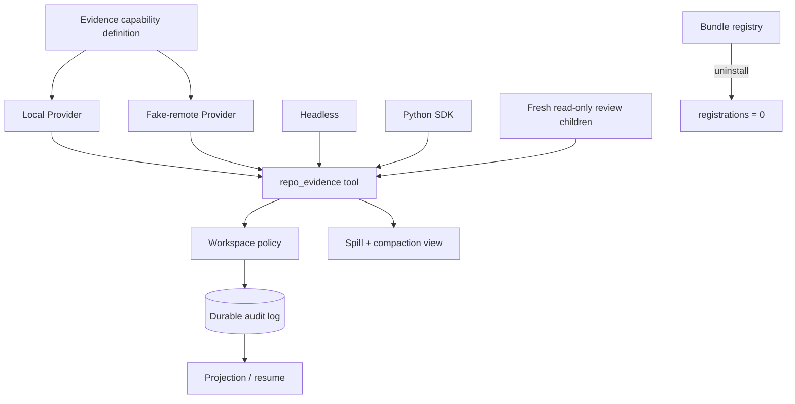

# L11 毕业项目：可审计仓库维护 Agent Bundle

毕业项目交付的不是一处 core loop 修改，而是一组可装卸、可换 Provider、可恢复的插件契约。这个确定性 Bundle 会先观察证据，再按策略修改；所有允许、询问和拒绝都会进入 durable audit；同一个工具由 headless 和 Python SDK 表面驱动。

## 先运行

```bash
./deepseek-harness-lessons/scripts/run_lesson.sh 11
node --experimental-strip-types deepseek-harness-lessons/11_capstone_auditable_bundle/tests/capstone.test.ts
```

无需安装 npm 包、无需 API key、不会读写真实仓库。模拟仓库、local Provider 和 fake-remote Provider 都固定在 `code.ts`，因此 trace 可以稳定 replay。

`pythonSdk()` 只是无依赖的绑定层模拟，并未执行上游 `python/sdk`；`install()` 也只验证课程注册/卸载契约，不等同于构建可发布 package。两者属于 course-composition，真实固定 SHA Loader/profile/Python 入口保持 `skip`。
测试会双跑 capstone，并把 durable snapshot 的 SHA-256 与 `tests/fixtures/expected.ts` 对照。

## 架构



### Capability 与工具

`EvidenceCapabilityDefinition` 拥有 Provider 契约；`LocalEvidenceProvider` 与 `FakeRemoteEvidenceProvider` 都返回 `EvidenceRecord`。`RepoEvidenceTool` 只持有 Provider getter，所以 `selectProvider()` 只改配置引用，tool、policy 和 consumer 都不变。

面向模型的 `repo_evidence` 同时声明 input/output schema。输出包含 `provider`、结构化 `records` 和可回读 `locators`；失败不会返回空成功。

### 策略与审计

`WorkspacePolicy` 拥有已观察路径和 approval 状态：

- workspace 外的 observe/modify 都是 `deny`；
- workspace 内但没有取得非空 evidence 的 modify 是 `deny`；空查询结果不会把路径标成 observed；
- 已观察的普通修改是 `allow`；
- dangerous 修改先返回 `ask + requestId`。requestId 绑定 `modify + 规范化 path + 精确 content`；普通修改夹带 ID、未知/伪造 ID、错路径或替换 payload 都拒绝，正确 ID 成功使用后立即失效。

`AuditLog` 拥有 append-only 事件，`AuditProjection` 只从事件重建 observed/modified/denied/pending/provider/subagent/model-message 视图。`DurableSession.resume()` 还会校验保存的模型历史与 `model.message` 事件一致；两者不一致时 fail closed。

### 上下文与子任务

超过 spill 阈值或 compaction token 预算的工具结果一律先 spill，避免中等长度文本直接压缩成无原值 checkpoint。本毕业项目用自定义 `context.spilled` durable event 保存完整 rendered content 和 locator；模型视图再按预算 compaction，只保留 locator 与标记的 `FACT:`。固定上游的 `ToolExecutionSuccess.value` 是 execution-local canonical value，默认不会写入 durable tool event，因此真实插件若需要恢复完整内容，必须像这里一样显式定义持久化契约。`contextCanonicalIntact=true`、`contextResumeIntact=true` 和 `compactionCount=1` 分别是当前存储、恢复存储与视图证据。

`runFreshReadOnlyReview()` 先创建全部 fresh lineage 并记录 barrier，再在 child 自己的 policy/audit scope 中收集报告和 join；child 的观察不会授予 parent 修改权限。报告固定包含 `workerId`、`mode=fresh`、`readonly=true`、findings 和显式终态。它是确定性并发调度模拟，不创建真实线程。

## 固定快照阅读路径

| 毕业项目组成 | 快照源码锚点 |
| --- | --- |
| installable package / bundle | `docs/cookbook/adding-a-package.md` |
| model-facing tool | `docs/cookbook/adding-a-tool.md` |
| capability Definition / Provider / Consumer | `docs/capability-seams.md` |
| Provider 配置替换 | profile / patch 与 capability seam |
| LLM adapter（扩展阅读） | `docs/cookbook/adding-an-llm-adapter.md` |

这些锚点针对 commit `47f943859bef60e4160492346772ded9b24f765a`。本课类名和函数签名是课程模拟，不声称是 DeepSeek Harness 的稳定 API；真实 Bundle 必须在隔离上游 checkout 做 real-composition 验证。

## 验收矩阵

| 最终约束 | 本课证据 |
| --- | --- |
| 不修改 `packages/core/agent-loop` | 从 durable `repo.modified` targets 推导 `coreAgentLoopTouched=false`；真实上游仍须另查 Git diff |
| Provider 替换只改配置 | tool definition 前后相同，local/remote claim 一致 |
| 观察后才能修改 | unobserved `deny`，observed safe edit `allow` |
| 越界写失败且有记录 | `outsideModify=deny` + `audit/policy.denied` |
| dangerous action 需要批准 | forged/mismatched `deny`；绑定 action/path/content 的 ID 才能 `ask -> approved -> allow`，且只用一次 |
| 恢复后 audit / 模型历史一致 | `resumeConsistent=true`，tamper test 失败 |
| spill/compaction 不破坏原值 | locator 回读等于 canonical，事实仍在 view |
| spill 在恢复后仍可回读 | `contextResumeIntact=true` |
| fresh read-only child 可追踪 | 结构化 review report + audit lineage |
| 两种产品入口复用同一工具 | headless=local、Python SDK=fake-remote，schema 不变 |
| 插件卸载注册归零 | `registrationsAfterUninstall=0` |

`evidenceMatrix` 的 keyless-snapshot 行只确认生成了可比较的 durable trace；真正的确定性证据来自测试中的两次独立运行相等，并同时匹配固定 SHA-256 fixture。unit、HMR、persistence/replay 和 course-composition 也只覆盖本实验边界；固定上游 Loader 的 real-composition 与 real-API 都明确 `skip`。fake-remote 不证明网络故障语义，内存 audit 不证明断电持久性，policy 模拟不等同于 OS sandbox。
