# DeepSeek Harness 源码精读与插件工程课程设计（deepseek-harness-lessons）

## 结论

**单独开课。** 建议作为课程十二，名称为「DeepSeek Harness 源码精读与插件工程」，共 12 节（L00-L11），放在现有「Agent 执行骨架与上下文工程」之后。

现有 Harness 课回答的是：长任务为什么需要上下文账本、压缩、文件工作区、子代理隔离和渐进披露。新课回答的是另一个问题：**一个真实的工业级 Agent Harness，怎样用插件树、作用域、事件溯源和可替换能力，把这些机制组装成 CLI、Web 和 SDK 产品。**

因此本课不是 DeepSeek 产品使用手册，也不是把上游文档翻译一遍，而是一门固定源码快照上的「架构源码精读 + 插件工程实验课」。

## 研究快照

本设计基于 2026-08-16 实际检查的上游状态：

| 项目 | 检查结果 |
|---|---|
| 上游仓库 | `https://github.com/deepseek-ai/deepseek-harness` |
| 固定提交 | `47f943859bef60e4160492346772ded9b24f765a` |
| 提交时间 | 2026-08-13 19:38:46 +08:00 |
| 根版本 | `0.1.0-rc.5` |
| npm `latest` | 检查时已为 `0.1.0-rc.6` |
| Git tag / GitHub Release | 无 |
| 运行时 | Node.js `^22.19.0 || >=24.0.0`，pnpm `11.7.0` |
| 主语言 | TypeScript ESM |
| 许可证 | MIT |
| 稳定性声明 | Developer preview；上游明确声明会有破坏性变更 |

快照中约有 7,400 个文件、219 个 `packages/*/*` workspace package、2,500 余个 TypeScript/TSX 文件，以及覆盖 unit、property、snapshot、real-composition、Web 和 real-API 的大规模测试。规模只用于判断课程边界，不作为课程质量结论。

版本事实本身已经说明风险：GitHub HEAD 的根版本仍是 rc.5 时，npm `latest` 已经是 rc.6。课程必须固定完整 commit SHA，不能跟随 `master` 写成会自动保持最新的 API 教程。

### 本次调研的验证边界

已经实际完成：

- clone 并校验上游固定 SHA；
- 阅读根说明、架构文档、生成目录、核心源码、示例组合、测试策略与 CI 配置；
- 统计 package / source / test 规模；
- 查询 GitHub 与 npm 元数据；
- 运行 `npx @deepseek-ai/dsh@0.1.0-rc.6 --help`，确认已发布 CLI 能启动并暴露 profile / patch / dump-config 接口。

本次规划阶段没有执行上游源码的 `pnpm install`、完整 build、完整 test 或真实模型调用。因此「源码安装成功」「全部测试通过」「真实模型链路可用」都不是本设计已经证明的事实，必须由 L00-L02 试点补齐。

## 为什么值得单独成课

DeepSeek Harness 不是一个薄封装，也不是训练或 RL 评测 harness。它是完整的编码 Agent 产品运行时，具有足够多且彼此关联的独立学习问题：

1. **Everything is a plugin**：Cordis 的 Context、Service、依赖激活、typed events、Fiber、effect disposer 和 HMR 共同决定运行时结构。
2. **配置就是架构**：Profile、Bundle 和多层 patch 从空树组装出 Web、headless 或自定义产品；依赖决定激活顺序，配置行顺序不充当启动顺序。
3. **接口与默认实现解耦**：`Agent`、registry、inbox 和 live events 在 `dsh-agent`；默认 `ReactLoopAgent` 在独立的 `dsh-agent-loop`。
4. **Session 是事件溯源账本**：模型可见输入必须可由 append-only log 重建；UI、resume、fork、compaction、transcript 和 persistence 都是投影。
5. **工具调用是一条安全流水线**：schema、approval、guard、around middleware、执行、结果改写、并发调度、取消和审计不是一个 `call(function)` 可以概括的。
6. **能力按三种角色拆分**：Service Definition、Provider、Consumer 组成完整 capability；替换 Provider 不需要修改 Agent loop。
7. **同一骨架有多个产品表面**：Web、headless、ACP、JSON-RPC 和 Python SDK 共享 Agent spine，而不是各写一套 loop。
8. **验证体系可学习**：HMR 清理、模型请求重建、snapshot replay、真实组合测试和 real-API 测试形成了清晰的证据层级。

这些问题可以组成 8 个以上不重复、可离线实验验证的源码主题，满足独立成课门槛。

## 与现有课程的边界

| 维度 | 课程十一：Agent 执行骨架 | 课程十二：DeepSeek Harness 源码精读 |
|---|---|---|
| 核心问题 | 为什么需要 Harness 机制 | 一个大型 Harness 如何被组装和扩展 |
| 教学对象 | 通用方法论 | 固定版本的真实开源实现 |
| 主要语言 | Python | TypeScript，L10 再接 Python SDK |
| 主线 | 窗口经济与外置化 | 插件树、运行链路与事件溯源 |
| 代码落点 | `research-assistant` v5 | 独立课程实验 + 上游固定快照 |
| 实验方式 | 手写机制和收益矩阵 | 源码追踪、插件替换、失败注入和 replay |
| 稳定性 | 本仓自有实现 | 上游 developer preview 快照 |

重叠主题只做「概念到实现的映射」，不重新讲一遍：

- 上下文账本 -> `token-meter`、Session log、request reconstruction；
- 压缩 -> `compaction-basic`、surface replacement、tool-result pruner；
- 工具整形 -> canonical output、finalizer、spill policy；
- 子代理隔离 -> agent scope、spawn/fork Provider、child lifecycle；
- 文件工作区与权限 -> FS / shell / subprocess / sandbox capability；
- steering -> inbox 的 `followup` / `steer` / `inject` 三种语义；
- 渐进披露 -> system-prompt sections、agent instructions、skill filesystem。

不把本课继续塞进 `harness-lessons/`。该课程已经 10/10 封板并绑定 `research-assistant` v5 的收益矩阵；强行扩课会模糊「通用机制」和「某个实现」的边界。

## 学习者画像与前置要求

学习者已完成或掌握：

- Agent 手写课程中的 Function Calling、ReAct、规划和多 Agent；
- Agent 生产可靠性课程中的预算、幂等、HITL、恢复和观测；
- 现有 Harness 课程中的压缩、外置、子代理隔离和渐进披露；
- Git、Shell、异步编程、事件和依赖注入的基本概念。

新增技术门槛：

- Node.js `^22.19.0` 或 `>=24.0.0`；
- pnpm、TypeScript ESM、Vitest 基础；
- 能阅读 discriminated union、async generator、declaration merging 和 `AbortSignal`。

本仓主要面向 Python 开发者，因此 L00 必须提供一段紧凑的 TypeScript / monorepo 桥接，但不能用 Python 包装 TypeScript 源码来掩盖真实架构。每课的可运行入口改为 `code.ts`，而不是沿用 `code.py`；Python SDK 在 L10 正式进入。

## 学习目标

完成课程后，学习者应能：

1. 从 `dsh` CLI 追到 profile、bundle、patch 和最终 Cordis 插件树。
2. 解释 Service、inject、event、Fiber 和 effect disposer 如何共同实现可组合与可卸载。
3. 逐事件还原一次 Agent turn/step，并区分 durable session events 与 live Cordis events。
4. 说明为什么「model-visible means logged」，并验证 resume、fork 和 request reconstruction。
5. 实现一个 provider-neutral 流式 LLM adapter，并正确处理 chunk、tool arguments、usage、取消和错误。
6. 实现一个带 schema、canonical output、权限策略、并发约束和审计证据的工具。
7. 按 Definition / Provider / Consumer 拆出一项能力，只改配置即可替换 Provider。
8. 解释 global/host context、agent scope 和 isolated realm 的所有权与清理关系。
9. 比较 spawn/fork、one-shot/continuable subagent，以及 workflow worker 的边界。
10. 用同一组合驱动 headless、ACP / JSON-RPC 和 Python SDK，并为真实入口建立分层测试。
11. 在不修改 `ReactLoopAgent` 的前提下，交付一个可安装、可审计、可恢复的 Agent Bundle。

## 不做什么

- 不逐个讲解 219 个 package。
- 不覆盖完整 Web 前端、样式系统和所有 client plugin。
- 不深入证明 Cordis 论文中的形式化理论，只学习实现本课需要的运行时语义。
- 不把原生 Landlock、Windows ACL 或 E2B 内部实现作为必修；平台沙箱实测是可选实验。
- 不复制上游仓库到本仓，也不维护上游代码 fork。
- 不追随每个 rc 即时改写正文，不承诺课程 API 与未来稳定版相同。
- 不把 mock 结果描述成真实模型能力或生产安全结论。

## 风险与对策

| 风险 | 当前证据 | 课程对策 |
|---|---|---|
| API 快速变化 | Developer preview、无 tag、rc.5 / rc.6 已漂移 | 固定 SHA；原理与快照 API 分栏；只做显式升级 |
| 公开生态仍早期 | 上游当前不接受外部 PR，只通过 Discussions 收反馈 | 不把社区热度当成熟度；毕业项目只依赖公开扩展面 |
| 安装副作用 | `pnpm install` 的 postinstall 会安装 worktree-local hooks 和 merge driver；部分依赖有 native build | 只在独立 disposable clone 中安装；安装前后检查 Git 配置；不在本仓直接装上游 workspace |
| 平台差异 | Python runtime 与 Landlock 有平台限制，Windows / macOS x64 覆盖不同 | 设 Ubuntu x64 为参考环境；平台能力分必修 policy 与可选 native 实测 |
| TypeScript 门槛 | 本仓学习者主要是 Python 开发者 | L00 做最小桥接；源码实验保留 `code.ts`，不做伪装式 Python 包装 |
| 范围失控 | 219 个主 package、Web/CLI/SDK/native 多条线 | 只维护一条纵向主链和 source manifest；Web UI / native 内部不进必修 |
| 测试多不等于性能成熟 | 上游有严格 coverage 和多层测试，但 `BENCHMARK.md` 只有运行提示，perf/stress 主要为手动入口 | 不宣称工业吞吐；性能只做环境内基线，并把缺失基准作为批判性阅读材料 |
| 真实模型不确定 | Provider、凭据、模型行为和价格会变 | 默认 keyless；real-API 只作可选 smoke，结果带模型、日期和配置 |

## 参考运行环境

| 层级 | 约定 |
|---|---|
| 课程参考 CI | Ubuntu x64 + Node.js 24 + Corepack pnpm 11.7.0 |
| 次级开发环境 | macOS 14+ arm64；跑通 keyless 核心实验，不强求 Linux native sandbox |
| TypeScript | 复用固定上游 lockfile 和 workspace 工具链，不在课程侧浮动依赖 |
| Python SDK | Python 3.10+；必修前先校验当前平台是否有预构建 runtime |
| API Key | 默认不需要；`DEEPSEEK_API_KEY` 只用于显式 real-API smoke |
| 文件权限 | 所有 FS / shell / SDK 实验指向 `mktemp` 创建的明确临时目录或可丢弃 checkout |

上游 Python runtime 当前覆盖 Linux x64 / arm64 与 macOS 14+ arm64；Landlock 路径只在支持的 Linux 内核和架构上成立。Windows、macOS x64 或其他环境不能从 keyless policy test 推导出同等原生隔离能力。

## 贯穿主线

全课只追一条纵向数据流，再逐层替换它的能力：

```mermaid
flowchart LR
    A["CLI / Profile"] --> B["Bundle + Patch"]
    B --> C["Cordis Plugin Tree"]
    C --> D["Agent Registry + Inbox"]
    D --> E["Turn / Step Loop"]
    E --> F["Prompt + LLM Stream"]
    F --> G["Tool Pipeline"]
    G --> H["Session Event Log"]
    H --> I["Persistence / Replay"]
    I --> J["Web / Headless / SDK"]
```



贯穿问题是：

> 一条任务怎样穿过插件树、Agent loop、工具管线和 Session 日志；我们怎样在不修改 loop 的前提下，通过插件改变模型、工具、权限、上下文、执行环境和产品入口？

## 核心源码地图

课程只维护下面这组「主干源码锚点」，引用符号名和子系统，不引用易漂移的行号：

| 子系统 | 主要源码 / 文档 |
|---|---|
| CLI 与启动 | `apps/cli/src/bin.ts`、`apps/cli/src/profile-boot.ts` |
| Profile / Bundle | `packages/boot/app-boot/src/`、`packages/bundle/*/cordis.patch.yml` |
| Cordis | `vendor/cordis/src/context.ts`、`service.ts`、`events.ts`、`fiber.ts` |
| Agent 接口 | `packages/core/agent/src/` |
| 默认 loop | `packages/core/agent-loop/src/agent.ts`、`tool-calls.ts` |
| Session | `packages/core/session/src/types.ts`、`index.ts`、`surface.ts` |
| System prompt | `packages/core/system-prompt/src/` |
| LLM | `packages/llm/llm/src/`、`packages/llm/llm-deepseek/src/` |
| Tools | `packages/core/tools/src/`、`docs/tool-execution-pipeline.md` |
| Persistence | `packages/session/session-persistence*/` |
| Capability / scope | `docs/capability-seams.md`、`packages/core/scope/` |
| Sandbox | `packages/sandbox/`、`packages/fs/`、`packages/shell/`、`packages/subprocess/` |
| Context mechanisms | `packages/context/`、`packages/compaction/`、`packages/skill/`、`packages/spill/` |
| Subagent / workflow | `packages/subagent/`、`packages/workflow/` |
| Product surfaces | `packages/bundle/headless/`、`packages/acp/`、`packages/sdk/`、`python/sdk/` |
| Testing policy | `docs/testing.md`、各子系统 `tests/` |

## 教学与运行原则

1. **先观察，再解释，再替换**：每课先运行或回放一个行为，记录 trace，再读源码解释，最后用插件替换一层。
2. **稳定概念与快照 API 分栏**：README 中分别标注「可迁移原理」和「47f9438 快照实现」。
3. **每课一个反例**：漏调 `next()`、漏 disposer、静默 config 覆盖、未记录的模型输入、乱序工具提交等失败必须被测试捕获。
4. **默认 keyless**：mock 只替换 LLM / 网络 / 时钟等非确定边界，下游使用真实 Session、ToolRuntime、Loader 和 persistence。
5. **验证外部世界**：工具实验重读文件或重跑命令，不用 Agent 自述证明成功。
6. **真实入口优先**：package unit test 之外，至少有 Loader real-composition 或 snapshot 证据。
7. **安全实验隔离**：Shell、FS、SDK 和真实模型实验只指向临时目录或可丢弃 checkout。
8. **源码不入仓**：课程脚本把固定 SHA 克隆到忽略目录或临时目录，校验 commit 后再运行。

## 目录规划

```text
deepseek-harness-lessons/
├── README.md
├── upstream.lock.json
├── source-manifest.json
├── scripts/
│   ├── prepare_upstream.sh
│   ├── run_lesson.sh
│   └── check_upstream_drift.sh
├── common/
│   ├── fixtures/
│   ├── scripted_llm.ts
│   └── trace_recorder.ts
├── 00_baseline_source_map/
│   ├── README.md
│   ├── code.ts
│   ├── exercise.md
│   └── tests/
├── 01_cordis_lifecycle/
├── 02_profile_bundle_composition/
├── 03_agent_turn_step_loop/
├── 04_session_event_sourcing/
├── 05_llm_streaming_adapter/
├── 06_tool_execution_pipeline/
├── 07_capability_sandbox/
├── 08_context_scope/
├── 09_subagent_workflow/
├── 10_surfaces_testing/
└── 11_capstone_auditable_bundle/
```

`upstream.lock.json` 固定 repo、完整 SHA、观察到的 npm 版本、Node/pnpm 要求和检查日期。`source-manifest.json` 记录每课依赖的 package、文件和符号；漂移检查只报告变化，不自动升级。

课程 runner 将实验复制到固定 checkout 内的忽略目录再调用上游 pnpm/tsx/Vitest，从而复用上游 workspace 解析，同时不修改上游 tracked files。所有学生输出进入忽略的 `outputs/`。

## 课时设计（共 12 节）

### Lesson 00 — 开箱、版本锁定与源码地图

**核心问题**：这个项目究竟是什么，一次 `dsh` 启动会加载哪些层？

**源码锚点**：根 `README.md`、`package.json`、`apps/cli/src/bin.ts`、`apps/cli/src/profile-boot.ts`、`docs/architecture.md`、`docs/module-graph.md`。

**实验**：

- 校验 Node/pnpm 和固定 SHA；
- 运行已发布 CLI 的 `--help`，再运行源码侧 `--dump-config`；
- 对比 `base + web-app` 与 `base + headless` 的最终插件树；
- 用脚本生成只含本课主干 package 的源码地图；
- 读取一个 keyless replay fixture 的 Session JSONL，建立第一条事件时间线。

**TypeScript 桥接**：只讲后续必需的 ESM、async generator、union、module augmentation、workspace import 和 Vitest。

**验收**：`upstream.lock.json` 校验通过；`baseline_source_map.json` 与 `baseline_event_trace.json` 可确定性重建；不需要 API Key。

---

### Lesson 01 — Cordis：插件、服务、事件与可逆生命周期

**核心问题**：为什么「一切皆插件」不等于全局 callback 集合？

**源码锚点**：`vendor/cordis/src/context.ts`、`service.ts`、`events.ts`、`fiber.ts`，以及 `docs/cordis-primer.md`。

**实验**：

- 写一个最小观察者插件和一个 `MetricsService`；
- 用 `inject` 验证依赖未就绪时等待、服务出现后激活、服务消失后自动 dispose；
- 对比 `emit`、`serial`、`parallel`、`waterfall`；
- 卸载插件 Fiber，证明事件监听、工具注册和定时器全部撤销；
- 故意在 waterfall 中漏调 `next()`，观察短路并写回归测试。

**验收**：HMR-safety 测试证明重复装卸后注册数量回到基线，无 listener、timer 或 service 泄漏。

---

### Lesson 02 — Profile、Bundle、Patch 与配置驱动组装

**核心问题**：Web、headless 和自定义部署如何从同一套 package 组装出来？

**源码锚点**：`packages/boot/app-boot/src/profile.ts`、`packages/boot/app-boot/README.md`、`packages/bundle/base/cordis.patch.yml`、`web-app/cordis.patch.yml`、`headless/cordis.patch.yml`。

**实验**：

- 从空树依次叠加 Bundle、profile patch、home patch 和 `--patch` overlay；
- 验证同 id 的 patch 替换整个 config，而不是 deep merge；
- 用 Schemastery 让非法配置在 load 时响亮失败；
- 制作一个最小 course profile 和可安装 bundle；
- 修改配置并触发 reload，验证旧实例先清理、新实例再生效。

**反例**：把 row 顺序误当成启动顺序；只覆盖一个 config 字段却意外丢失其余字段。

**验收**：`--dump-config` diff 能解释每个最终值来自哪一层；非法配置响亮失败；缺失必需服务的插件保持 pending/inactive，诊断输出不能把它伪装成已激活。

---

### Lesson 03 — Agent Registry、Inbox 与 Turn / Step Loop

**核心问题**：一条用户输入怎样变成一个或多个模型 step？

**源码锚点**：`packages/core/agent/src/`、`packages/core/agent-loop/src/agent.ts`、`docs/agent-lifecycle.md`。

**实验**：

- 用 scripted LLM 和 observer plugin 捕获一次完整 turn；
- 对照 durable 的 `turn/start` / `step/start` / `request/header` / `assistant/*` / `tool/*` 与 live 的 `agent/request`、工具流水线事件，直到 `step/end` / `turn/end`；
- 分别注入 `followup`、`steer`、`inject`，验证 next-turn / next-step 与 wake / non-wake 语义；
- 在 pre-step、streaming 和 tool 执行三个位置取消，观察 balanced ending；
- 卸载 loop 所在 Fiber，证明运行中 Agent 收敛到 idle/disposed。

**验收**：生成 durable event 与 live event 两条对齐时间线；每个已开始的 turn/step 都有对应结束事件。

---

### Lesson 04 — Session 事件溯源、投影、恢复与 Fork

**核心问题**：为什么对话历史、UI 回放和模型上下文不是同一个数组？

**源码锚点**：`packages/core/session/src/types.ts`、`index.ts`、`surface.ts`、`packages/session/session-persistence*/`、`docs/persistence-catalog.md`。

**实验**：

- 对比 raw append-only log、surface projection、`deriveMessages()` 和 transcript；
- 用 surface range replacement 模拟 compaction，证明旧事件仍在而模型视图已替换；
- 检查 `request/header` 如何固定 provider/model/system/tool schemas；
- JSONL persistence 后 resume，同一日志重建相同模型历史；
- 在指定事件边界 fork，验证 lineage 和 child seed；
- 故意加入「模型可见但未记录」的上下文，触发 request reconstruction invariant。

**验收**：保存前后 `deriveMessages()` 深度相等；fork 不污染 parent；原始日志只追加不原地修改。

---

### Lesson 05 — LLM Runtime、流式协议与 Adapter

**核心问题**：Agent loop 如何不依赖某一家模型 SDK？

**源码锚点**：`packages/llm/llm/src/`、`packages/llm/llm-deepseek/src/adapter.ts`、`serialize.ts`、`sse.ts`、`translate.ts`，以及 `docs/subsystems/llm-streaming.md`。

**实验**：

- 实现一个 deterministic adapter，注册 provider route 和 model metadata；
- 输出 text、reasoning、tool-call arguments、usage 与 finish chunks；
- 用 `BlockAssembler` 组装最终 assistant message；
- 模拟 malformed chunk、trailing usage、context overflow、retry 和 mid-stream cancel；
- 验证 `prepareCall` 固化 adapter defaults 后才写 `request/header`；
- 对比 direct DeepSeek adapter 与 `llm-pi-ai` Provider 的共同接口。

**验收**：同一 fixture 每次生成相同 event stream；错误被规范化为稳定事实；失败前的未提交 chunk 不产生虚假工具副作用。

---

### Lesson 06 — Tool Runtime：Schema、安全流水线与并发调度

**核心问题**：一个工具从 model schema 到 durable result 要经过哪些约束？

**源码锚点**：`packages/core/tools/src/index.ts`、`schema.ts`、`packages/core/agent-loop/src/tool-calls.ts`、`docs/tool-execution-pipeline.md`。

**实验**：

- 用 `defineTool` 定义输入 schema、canonical JSON output 和 model render；
- 分别安装 `tools/pre-execute`、guard、`tools/execute` wrapper 和 `tools/post-execute`；
- 验证 allow / ask / deny、timeout、result replacement、finalizer 和 frozen final result；
- 运行两个 concurrency-safe 工具和一个 exclusive barrier，区分 dispatch 并发与 model-order commit；
- 在滚动并发池中 abort，验证已启动调用被 drain、未启动调用有 synthetic error；
- 对比 native tools 与 Code Mode，证明子调用仍经过同一安全管线。

**验收**：正常、拒绝和取消路径中的 `tool/call` 都有唯一 `tool/result`；并发执行不改变提交顺序；调度器内部故障显式失败并保留已写 call，不用伪造 result 掩盖故障。

---

### Lesson 07 — Capability Seam、作用域与执行安全

**核心问题**：怎样替换执行环境而不 fork 工具或修改 loop？

**源码锚点**：`docs/capability-seams.md`、`packages/core/scope/`、`packages/fs/`、`packages/shell/`、`packages/subprocess/`、`packages/sandbox/`。

**实验**：

- 为「证据读取」拆出 Definition、local Provider 和 model-facing Consumer；
- 增加 fake-remote Provider，只改 profile 配置完成替换；
- 给两个 Agent 建 isolated realm，证明它们看到不同 Provider、工具和策略；
- 把 FS 与 shell 指向同一执行世界，验证 consumer 无需 Provider 专用分支；
- 在 workspace-write 下验证越界失败和一次性 approval retry；
- dispose Agent scope，证明 scoped 能力整组撤销。

**平台边界**：必修实验验证 policy 和 ownership；Linux Landlock、Windows ACL 和 E2B 的真实隔离作为可选平台实验，不从 macOS mock 推导生产安全。

**验收**：Provider 替换时 consumer 和 loop 零改动；越界动作 fail closed；放行与拒绝都有 durable audit。

---

### Lesson 08 — 上下文、压缩、Skill 与 Spill 的实现映射

**核心问题**：课程十一学过的 Harness 机制，在 DeepSeek Harness 中分别挂在哪些扩展点？

**源码锚点**：`packages/core/system-prompt/`、`packages/context/`、`packages/compaction/`、`packages/skill/`、`packages/spill/`、`packages/llm/token-meter/`。

**实验**：

- 追踪 persona、runtime context、tool schemas 和 skill sections 的组装顺序；
- 构造长工具结果，分别运行裸基线、pruner、spill、compaction 和组合档；
- 比较 raw log 大小、模型可见 token、关键事实保留、可追溯 locator 和压缩次数；
- 验证 spill 只改变模型 / durable copy 中允许改变的视图，不破坏 canonical value；
- 在 agent scope 中加载不同 skill，证明全局目录不会无条件进入每个 Agent。

**边界**：本课不重新讲「为什么需要压缩」，只解释实现、所有权、事件和不变量。

**验收**：输出机制映射表与消融矩阵；清楚区分空间收益、语义收益和 mock 不能证明的认知收益。

---

### Lesson 09 — Subagent、Workflow 与所有权

**核心问题**：子任务是新建、fork、后台续跑还是 worker workflow，分别意味着什么？

**源码锚点**：`packages/subagent/`、`packages/workflow/`、`packages/jobs/`、`docs/subsystems/subagent.md`。

**实验**：

- 对比 fresh spawn 与 completed-prefix fork；
- 对比 one-shot 与 continuable child，发送 follow-up 并收结构化 report；
- 观察 parent、child Session 与 projection 的分离；
- 在 child 运行中 cancel/dispose parent，验证所有权和 quiescence；
- 用 workflow worker-thread 并发调用多个 Agent，再从 durable log 重建结果；
- 注入 child 失败，证明失败不会被折叠成空成功。

**验收**：parent 主窗不混入 child 过程；每个 child 有可追踪 lineage、终态和清理证据；后台任务没有遗留进程。

---

### Lesson 10 — 多产品表面与证据分层

**核心问题**：怎样证明同一 Agent spine 在真实产品入口中成立？

**源码锚点**：`packages/bundle/headless/`、`packages/acp/`、`packages/sdk/`、`python/sdk/`、`examples/headless-agent/`、`examples/jsonrpc-agent/`、`docs/testing.md`。

**实验**：

- 复用同一 course capability/plugin stack，分别叠加 headless app 与 JSON-RPC / Python SDK app 入口；
- 比较两种入口产生的核心 durable events；
- 观察 ACP 的 permission、cancel 和 protocol-pure stdout；
- 为一个行为分别写 unit、HMR-safety、real-composition 和 keyless snapshot；
- 可选 real-API smoke 只替换 LLM 边界，外部重读 workspace 证明实际结果；
- 演示「mock 全绿、发布入口失败」的负例，补 built-artifact smoke。

**验收**：无 Key 的 CI 路径稳定；真实 API 测试无 Key 时显式 skip；snapshot、unit 与 real-API 的结论不混报。

---

### Lesson 11 — 毕业项目：可审计仓库维护 Agent Bundle

**目标**：交付一个可安装 profile / bundle，证明学习者理解的是架构，而不是会修改上游核心。

毕业项目包含：

- `evidence` capability：Definition + local Provider + fake-remote Provider；
- 面向模型的 `repo_evidence` 工具，输入输出 schema 与引用 locator 完整；
- 观察后才能修改、workspace 外拒绝、危险动作 ask 的策略插件；
- 自定义持久审计事件及 projection，resume 后仍可查询；
- 长结果 spill / compaction 配置；
- 一个 fresh subagent 做并行只读审查，并返回结构化结论；
- headless 入口和 Python SDK 驱动；
- unit、HMR、persistence/replay、real-composition、keyless snapshot 和可选 real-API smoke。

**最终约束**：不修改 `packages/core/agent-loop`；替换 evidence Provider 只改配置；插件卸载后注册归零；恢复后审计事件和模型历史一致；越界写入失败且有记录。

## 每课交付规范

每课至少包含：

- `README.md`：核心问题、稳定原理、快照实现、源码导读、流程图、失败模式、运行方式和证据边界；
- `code.ts`：可直接运行的最小实验，不做大段源码复制；
- `exercise.md`：概念题、改码题、失败注入题和设计实验题；
- `tests/`：至少一个正例、一个反例和一个 disposer / replay 相关断言；
- 确定性输出 fixture：只提交小型 trace / snapshot，不提交运行缓存或完整上游源码。

每课 README 必须回答：

1. 这一层拥有什么状态？
2. 它通过 Service、event 还是 SessionEvent 与其他层交互？
3. 卸载、取消或恢复时谁负责收尾？
4. 哪条证据能证明行为，哪条证据不能？
5. 这个结论是通用原理，还是仅适用于固定快照？

## 验证分层

| 层级 | 默认 | 能证明什么 | 不能证明什么 |
|---|---:|---|---|
| Static source check | 是 | SHA、文件、符号和配置仍存在 | 运行行为正确 |
| Unit / property | 是 | 局部不变量、边界与并发性质 | 发布入口可用 |
| HMR-safety | 是 | disposer 与重复装卸无泄漏 | 完整产品组装 |
| Real-composition | 是 | Loader、profile、真实下游组件协同 | 真实模型质量 |
| Keyless snapshot / replay | 是 | 对外 transcript 与重放稳定 | Provider API 可用 |
| Real-API smoke | 可选 | 当前凭据、模型和真实工具闭环 | 通用生产 SLA |
| Platform sandbox | 可选 | 指定 OS / 后端的真实隔离 | 其他平台同等安全 |

课程默认 mock 只替换昂贵或非确定边界。工具、Session、persistence、Loader 和 policy 尽量使用真实实现。

## 上游漂移与维护策略

### 固定快照

- 正文、实验和 snapshot 都绑定完整 commit SHA；
- 上游没有稳定 tag 前，课程标题持续标记「源码快照课」；
- npm 版本只用于运行已发布 CLI，不代替源码 SHA；
- 不使用行号作为长期锚点，使用 package + file + exported symbol。

### 漂移检测

`check_upstream_drift.sh` 只做只读检查并生成报告：

- upstream HEAD 与固定 SHA 是否不同；
- npm `latest` 是否变化；
- `source-manifest.json` 的文件和符号是否仍存在；
- package graph、profile dump 和核心 event vocabulary 是否变化。

漂移不会自动更新课程。自动跟随会让旧实验的证据失去解释力。

### 升级门槛

只有在以下情况之一发生时才评估升级：

- 上游发布第一个稳定 tag；
- 新版本修复课程关键路径的严重问题；
- 新架构使当前快照失去主要教学价值。

升级必须先跑兼容矩阵：boot/dump-config、Cordis dispose、turn trace、Session replay、tool policy、Provider swap、subagent cleanup、headless/SDK snapshot 和 capstone。无法兼容时保留旧快照课程，并新增迁移附录，不静默改写历史结论。

### 许可证与引用

- 不把 10 万行级上游源码 vendoring 到本仓；
- 小段源码引用标明 MIT、commit 和 path；
- 课程实验是独立实现，避免复制整个 package；
- README 明确声明本课不是 DeepSeek 官方课程。

## 实施顺序

### 阶段 0：设计确认（本次）

- 完成本课程设计；
- 不创建空课程目录；
- 不修改根 README 的 11 门 / 115 节统计。

### 阶段 1：三课试点（L00-L02）

- 实现 upstream lock、prepare runner 和 source manifest；
- 验证 macOS / Linux 的 keyless 安装与 targeted tests；
- 完成 Cordis 生命周期与配置分层两个最关键实验；
- 记录首次安装耗时、磁盘占用、Node 兼容和上游漂移。

试点通过标准：新环境可按 README 完成，三课无 Key 全绿，重复运行不改上游 tracked files，且全部失败注入会按预期变红。

### 阶段 2：运行时主干（L03-L07）

- 依次完成 loop、Session、LLM、tools、capability；
- 每课复用同一 scripted LLM 和 trace vocabulary；
- 先做 package test，再补 real-composition 证据。

### 阶段 3：高级能力与产品入口（L08-L10）

- 用现有 Harness 课程做概念映射；
- 完成 subagent/workflow 和 headless/SDK 双入口；
- 固化 keyless snapshot 与可选 real-API smoke。

### 阶段 4：毕业整合与全仓注册（L11）

- 完成可审计 Bundle 与验收矩阵；
- 再同步根 `README.md` / `README.en.md` 的课程路线、课程数、课时数和目录树；
- 更新 changelog、issue template、课程总览和实测测试数字；
- 只有真实完成时才把总数从 115 调整为 127，不能在规划阶段预支完成度。

每课单独实现、验证和提交，不批量生成 12 课空壳。

## 开课前最终检查

进入 L00 前再确认一次：

1. 固定 SHA 仍可 clone，MIT 许可证未变化；
2. Node `^22.19.0` 或 `>=24.0.0` 与 pnpm lockfile 能完成安装；
3. `dsh --help`、`--dump-config` 和一个 keyless targeted test 可运行；
4. scripted LLM 能驱动真实 Session + ToolRuntime；
5. 课程 runner 不写当前主仓或上游 tracked files；
6. 上游若已发布稳定 tag，重新决定快照基线，但不直接切换。

这六项通过后，正式进入 L00；否则先修课程基础设施，不开始写正文。
